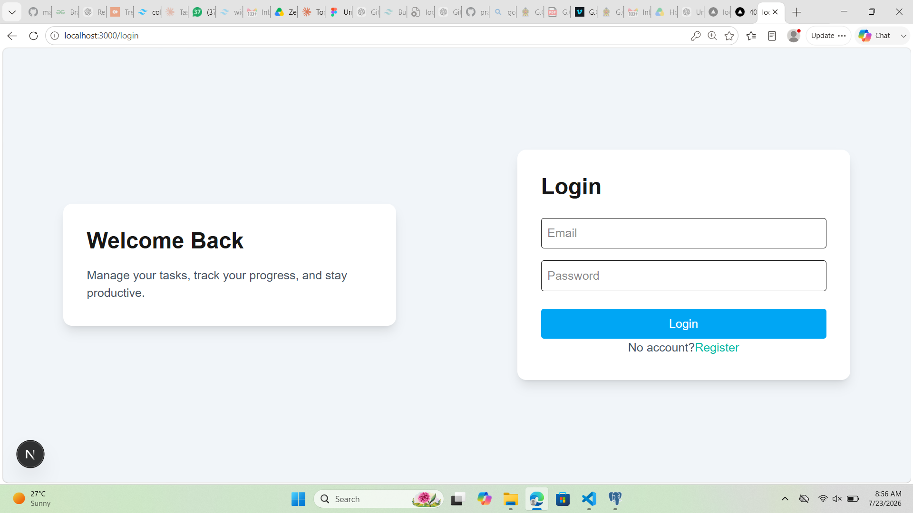
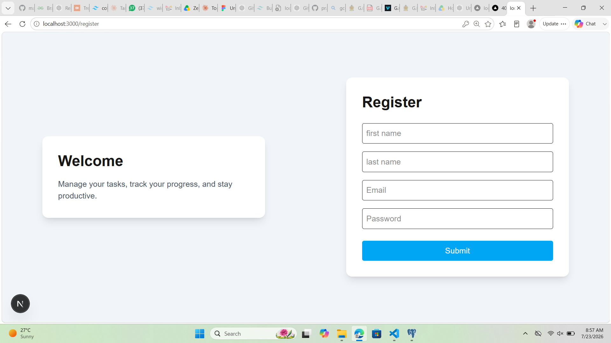
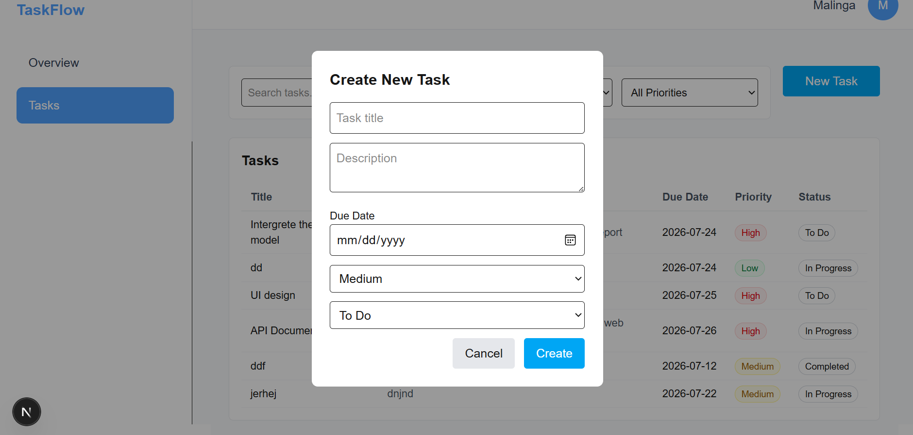
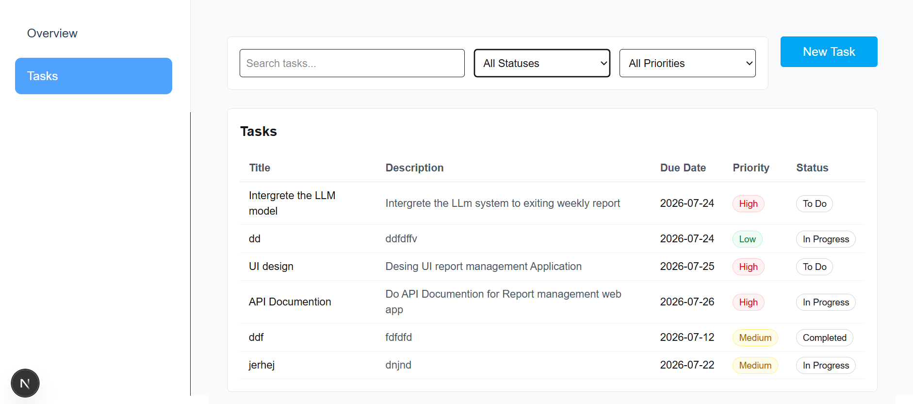
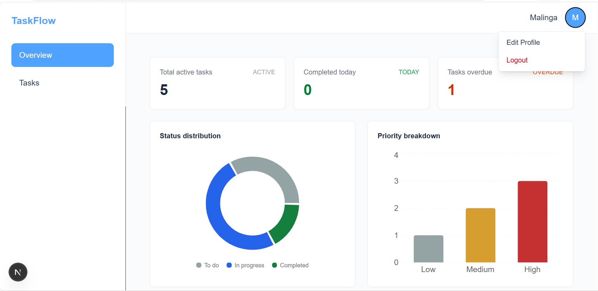

# Task Management System (Mini-ERP) — Frontend

A task management dashboard built with Next.js (App Router), featuring authentication, task CRUD, and an analytics overview.







## Features

- User authentication (login / register) with cookie-based sessions
- Protected routes — unauthenticated users are redirected to `/login`
- Task management: create, view, edit, delete
- Search and filter tasks by status and priority
- Analytics overview: summary cards, status distribution (donut chart), priority breakdown (bar chart)
- User profile view with edit (first name, last name, email) and logout



## Tech Stack

| Tool | Why it was chosen |
|---|---|
| **Next.js (App Router) + TypeScript** | File-based routing keeps auth-protected and public routes cleanly separated (via route groups like `(protected)`); TypeScript catches API/shape mismatches at compile time rather than at runtime. |
| **Tailwind CSS** | Utility classes keep styling co-located with markup, speeding up iteration on forms, modals, and dashboard cards without maintaining separate stylesheet files. |
| **Recharts** | Lightweight, React-native charting library (donut + bar charts) that composes well with Tailwind-styled cards, without needing a heavier charting engine. |
| **Cookie-based auth (HttpOnly)** | Keeps the auth token out of reach of client-side JavaScript (mitigates XSS token theft) compared to storing it in `localStorage`. All requests use `credentials: "include"` to send the cookie automatically. |

## Prerequisites

- Node.js 18+
- The backend API running — see the [backend repository](<backend-repo-url>) for setup instructions

## Setup Instructions

1. **Clone the repository**
   ```bash
   git clone <frontend-repo-url>
   cd task-managment-fe
   ```

2. **Install dependencies**
   ```bash
   npm install
   ```

3. **Configure environment variables**

   Copy the example file and fill in your values:
   ```bash
   cp .env.example .env.local
   ```

   `.env.local`:
   ```
   NEXT_PUBLIC_API_URL=http://localhost:5000/api
   ```

   | Variable | Description |
   |---|---|
   | `NEXT_PUBLIC_API_URL` | Base URL of the backend API |

4. **Run the development server**
   ```bash
   npm run dev
   ```

   Open [http://localhost:3000](http://localhost:3000) in your browser.

## Available Scripts

| Command | Description |
|---|---|
| `npm run dev` | Start the development server |
| `npm run build` | Create a production build |
| `npm run start` | Run the production build locally |

## Project Structure

```
src/
  app/
    (protected)/       # Routes requiring authentication
      layout.tsx        # Auth check + shared NaviBar
      overview/          # Analytics dashboard
      task/               # Task list, filters, create/edit/delete
    login/
    register/
    page.tsx             # Root — redirects based on auth status
  components/
    common/              # Shared components (NaviBar, EditProfileModal, SideBar)
  lib/
    service/              # API call functions (auth, task, user)
```

## Notes

- Auth token is stored in an HttpOnly cookie set by the backend; all API requests use `credentials: "include"`.
- Protected pages live under `app/(protected)/` and share a layout that checks authentication on mount before rendering.